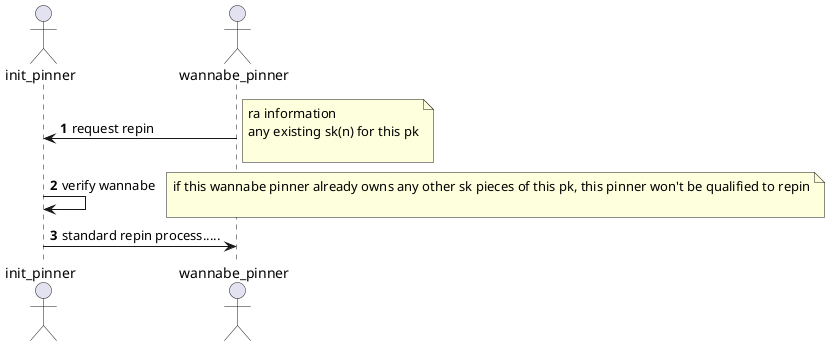
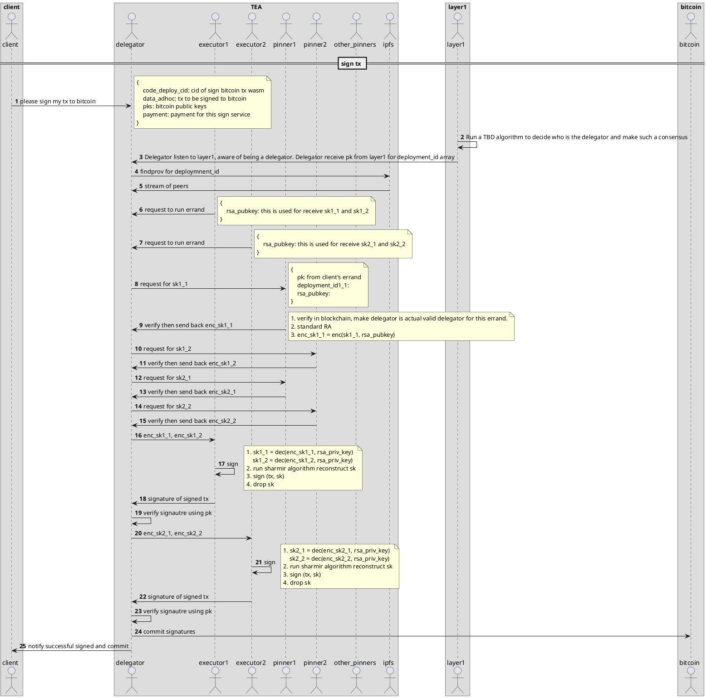

# Key generation

```puml
@startuml
autonumber

box  client
actor client
end box

box TEA
actor delegator
actor executor1
actor executor2
actor other_executor
actor init_pinner1
actor init_pinner2
actor other_wannabe_pinners
end box


box layer1
actor layer1
end box

== key generation ==

client -> layer1 : Create Task (Generate blockchain key.)
note right
tea errand:{
    code_cid: the cid of generate bitcoin key wasm,
    data_adhoc:{
        n: 2,
        k: 1,
        other: etc,
    },
    payment: etc,
}
end note

layer1 -> delegator : Global consensus to decide delegator


executor1 -> delegator: request for task
note right
{
    rsa_pubkey:  // this is actor generated temp rsa key pair
    ra_info: //let delegator to RA myself
}
executor2 -> delegator: request for task
note right
{
    rsa_pubkey:  // this is actor generated temp rsa key pair
    ra_info: //let delegator to RA myself
}
end note
init_pinner1 -> delegator: request for init pin

note right
{
    rsa_pubkey:  // this is actor generated temp rsa key pair
    ra_info: //let delegator to RA myself
}
end note
init_pinner2 -> delegator: request for init pin

delegator -> delegator: run selection algorithm to choose executor and init pinner
note right
RA need to pass
total number of init pinner is n
end note
delegator -> delegator: run RA to selected executor and init pinner
delegator -> executor1: send errand detail 
note right
{
    errand: the errand from client,
    init_pinners_rsa: [rsa1_1_from_pinner1, rsa1_2_from_pinner2],
}
end note
executor1 -> executor1 : Run algorithm
note right
1. generate bitcoin (pk1, sk1)
2. use shamir secure share schema to split sk1 into sk1_1 and sk1_2 (n=2)
3. sk1_enc = enc(sk1_1, rsa1_1_from_pinner1) 
   sk2_enc = enc(sk1_2, rsa1_2_from_pinner2)
4. destroy sk1

end note
executor1 -> delegator:  send {pk1, sk1_1_enc, sk1_2_enc}
delegator -> init_pinner1 : {pk1, sk1_1_enc}
delegator -> init_pinner2 : {pk1, sk1_2_enc}

init_pinner1 -> init_pinner1: deploy sk1_1
note right
1. sk1 = dec(sk1_1_enc, rsa1_1_sk)
2. generate deployment_id1_1
3. store sk1_1 in memory use pk1 as index
4. announce myself to be init pinner of deployment_id1_1 as 
end note
init_pinner1 -> delegator: deplolyment_id1_1
init_pinner2 -> init_pinner2: deploy sk1_2
init_pinner2 -> delegator: deployment_id1_2

delegator -> executor2: send errand detail 
note right
{
    errand: the errand from client,
    init_pinners_rsa: [rsa2_1_from_pinner1, rsa2_2_from_pinner2],
}
end note
executor2 -> executor2 : Run algorithm
note right
1. generate bitcoin (pk2, sk2)
2. use shamir secure share schema to split sk2 into sk2_1 and sk2_2 (n=2)
3. sk1_enc = enc(sk2_1, rsa2_1_from_pinner1) 
   sk2_enc = enc(sk2_2, rsa2_2_from_pinner2)
4. destroy sk2
end note

executor2 -> delegator:  send {pk2, sk2_1_enc, sk2_2_enc}
delegator -> init_pinner1 : {pk2, sk2_1_enc}
delegator -> init_pinner2 : {pk2, sk2_2_enc}

init_pinner1 -> init_pinner1: deploy sk2_1
note right
1. sk1 = dec(sk2_1_enc, rsa2_1_sk)
2. generate deployment_id2_1
3. store sk2_1 in memory use pk2 as index
4. announce myself to be init pinner of deployment_id2_1 as 
end note
init_pinner1 -> delegator: deplolyment_id2_1
init_pinner2 -> init_pinner2: deploy sk2_2
init_pinner2 -> delegator: deployment_id2_2

delegator -> layer1: complete errand, save (pk1, [deplolyment_id1_1, deployment_id1_2]) and (pk2, [deplolyment_id2_1, deployment_id2_2]) to the blockchain

other_wannabe_pinners -> init_pinner1: repin request
other_wannabe_pinners -> init_pinner2: repin request

layer1 -> client : PKs

@enduml
```

# Repin sk pieces

```puml
@startuml
autonumber
actor init_pinner
actor wannabe_pinner

wannabe_pinner -> init_pinner: request repin
note right
ra information
any existing sk(n) for this pk

end note
init_pinner  -> init_pinner: verify wannabe
note right
if this wannabe pinner already owns any other sk pieces of this pk, this pinner won't be qualified to repin

end note
init_pinner -> wannabe_pinner: standard repin process.....
@enduml
```

# Sign tx

```puml
@startuml
autonumber
box  client
actor client
end box

box TEA
actor delegator
actor executor1
actor executor2
actor pinner1
actor pinner2
actor other_pinners
actor ipfs
end box


box layer1
actor layer1
end box

box bitcoin
actor bitcoin
end box
== sign tx ==
client -> delegator: please sign my tx to bitcoin
note right
{
    code_deploy_cid: cid of sign bitcoin tx wasm
    data_adhoc: tx to be signed to bitcoin
    pks: bitcoin public keys
    payment: payment for this sign service
}
end note
layer1 -> layer1: Run a TBD algorithm to decide who is the delegator and make such a consensus
delegator <- layer1: Delegator listen to layer1, aware of being a delegator. Delegator receive pk from layer1 for deployment_id array
delegator -> ipfs: findprov for deploymnent_id
ipfs -> delegator: stream of peers
executor1 -> delegator: request to run errand
note right
{
    rsa_pubkey: this is used for receive sk1_1 and sk1_2
}
end note
executor2 -> delegator: request to run errand
note right
{
    rsa_pubkey: this is used for receive sk2_1 and sk2_2
}
end note

delegator -> pinner1: request for sk1_1
note right
{
    pk: from client's errand
    deployment_id1_1:
    rsa_pubkey:
}
end note
pinner1 -> delegator: verify then send back enc_sk1_1
note right
1. verify in blockchain, make delegator is actual valid delegator for this errand.
2. standard RA
3. enc_sk1_1 = enc(sk1_1, rsa_pubkey)
end note

delegator -> pinner2: request for sk1_2
pinner2 -> delegator: verify then send back enc_sk1_2
delegator -> pinner1: request for sk2_1
pinner1 -> delegator: verify then send back enc_sk2_1
delegator -> pinner2: request for sk2_2
pinner2 -> delegator: verify then send back enc_sk2_2

delegator -> executor1: enc_sk1_1, enc_sk1_2
executor1 -> executor1: sign
note right
1. sk1_1 = dec(enc_sk1_1, rsa_priv_key)
    sk1_2 = dec(enc_sk1_2, rsa_priv_key)
2. run sharmir algorithm reconstruct sk
3. sign (tx, sk)
4. drop sk
end note
executor1 -> delegator: signature of signed tx
delegator -> delegator: verify signautre using pk

delegator -> executor2: enc_sk2_1, enc_sk2_2
executor2 -> executor2: sign
note right
1. sk2_1 = dec(enc_sk2_1, rsa_priv_key)
    sk2_2 = dec(enc_sk2_2, rsa_priv_key)
2. run sharmir algorithm reconstruct sk
3. sign (tx, sk)
4. drop sk
end note
executor2 -> delegator: signature of signed tx
delegator -> delegator: verify signautre using pk

delegator -> bitcoin: commit signatures
delegator -> client: notify successful signed and commit

@enduml
```
